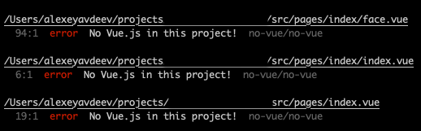

# eslint-plugin-no-vue

[](https://www.npmjs.com/package/eslint-plugin-no-vue)
[](https://www.npmjs.com/package/eslint-plugin-no-vue)

This is an ESLint plugin to disable Vue.js.



## Installing

`npm install eslint-plugin-no-vue --save-dev`

## ESLint Rules

### no-vue

Don't even try it!

## Sample Configuration File

Here's a sample ESLint configuration file that activates these rules:

```
{
  "plugins": [
    "no-vue"
  ],
  "rules": {
    "no-vue/no-vue": "error",
  }
}
```

## Credits

Inspired by https://github.com/shitjs/eslint-plugin-no-js
